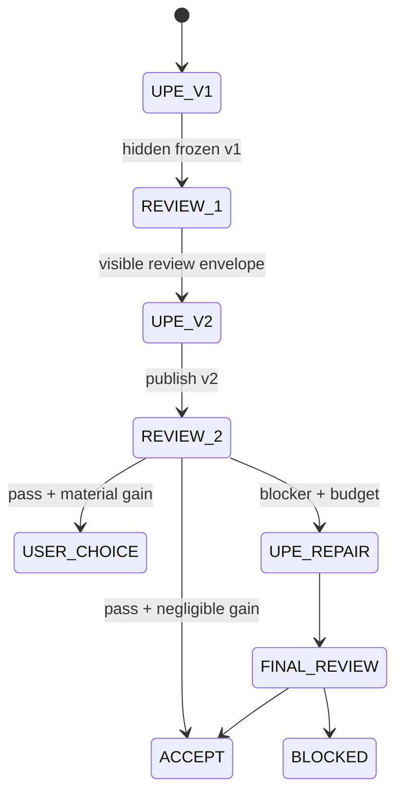

# UPE v5.6.0.2 — Web Work Native-Subagent Adapter

**Adapter ID:** `web_work_native_subagent`  
**Profile date:** 2026-07-26  
**Status:** capability-dependent draft adapter  
**Applies to:** ChatGPT Work on web or another Work host that exposes native subagent delegation to the current run

This adapter operationalizes UPE’s terminal framework review inside one Work run. It is a serial author → reviewer → rework loop. It is not a parallel-research route, a Custom-GPT-to-GPT call, a scheduled task, or proof of security-grade process isolation.

## 1. Activation gate

Select this route only when all required operations are actually exposed:

```yaml
web_work_native_subagent_availability:
  target_surface: web_work
  operations:
    spawn_fresh_child: available | unavailable | unknown
    receive_child_result: available | unavailable | unknown
    send_follow_up: available | unavailable | unknown
    wait_or_status: available | unavailable | unknown
    interrupt: available | unavailable | unknown
  context_control:
    fresh_without_parent_history: available | unavailable | unknown
  candidate_transport: inline_frozen_copy | immutable_reference | shared_writable_path | unknown
  selected: true | false
  evidence:
  fallback:
```

Documentation, subscription, a model label, or Ultra availability is not sufficient evidence by itself. Prefer verified current-run operations.

Selection requires all of:

- `spawn_fresh_child: available`;
- `receive_child_result: available`;
- `fresh_without_parent_history: available`;
- `candidate_transport` is `inline_frozen_copy` or `immutable_reference`.

`send_follow_up`, `wait_or_status`, and `interrupt` are preferred lifecycle controls rather than unconditional activation blockers. If one is unavailable, record it and use the bounded fallback already defined for that operation: a new child instead of follow-up, result return instead of polling, or disregard/hash-invalidate a stale branch instead of interrupting it. If a required selection field is unavailable or unknown, do not select this adapter. A shared writable path may support advisory review but does not activate a qualifying independent route.

This workflow is serial because every stage consumes the previous stage’s frozen output. Do not mislabel it `native_parallel`.

## 2. Independence classes

Record two different properties instead of compressing them into “independent”:

```yaml
review_independence:
  cognitive:
    no_candidate_authorship: true | false | unknown
    fresh_context: true | false | unknown
    hidden_author_reasoning_received: false | true | unknown
    qualifies: true | false | unknown
  integrity:
    candidate_transport: inline_frozen_copy | immutable_reference | shared_writable_path | unknown
    pre_review_sha256:
    post_review_sha256:
    unchanged: true | false | unknown
  authority:
    candidate_write_authority: none | present | unknown
    external_side_effect_authority: none | present | unknown
    output_scope: proposal_only
  technical_isolation:
    enforcement: host_sandbox | immutable_store | hash_guarded_copy | prompt_only | unknown
    per_child_tool_allowlist_proven: true | false | unknown
    security_grade_isolation_claimed: false
  terminal_gate:
    qualifies: true | false
    status: PENDING | PASS | FAIL | UNKNOWN
```

A native child can provide useful cognitive independence without proving a separate security boundary. The terminal gate qualifies only when:

- the child did not author v1;
- it starts without parent conversation history;
- it receives the frozen request, contract, candidate, and evidence—but not hidden author reasoning;
- it receives an inline frozen copy or immutable reference, not the original writable candidate;
- its authority explicitly prohibits candidate mutation and external side effects;
- the coordinator verifies the candidate hash after review;
- all critical fields are known and non-contradictory.

If the only transport is a shared writable path, the review may continue as `ADVISORY`, but the independent gate remains `UNKNOWN` unless the host supplies an enforcement mechanism that closes the gap. Never upgrade prompt-only restrictions into a security-grade claim.

## 3. Default standard-mode workflow



### Stage W0 — resolve and freeze

The UPE coordinator:

1. freezes the original request and complete M/E/A/X/D ledger;
2. verifies this adapter’s activation gate;
3. resolves `standard` or `fast` mode;
4. records the round budget and exit thresholds;
5. reserves reviewer output locations or structured result fields.

### Stage W1 — generate v1 without publishing

In standard mode, UPE creates candidate v1 but does not place its contents in the user-facing answer. Commentary may state that the candidate is under review without revealing v1.

Freeze v1 using:

- exact candidate title and iteration label;
- complete candidate content or complete sorted per-file manifest;
- SHA-256 for the candidate/package;
- relevant evidence and eval results;
- acceptance contract and known limits.

`v1` and `v2` are iteration labels, not release-version increments.

### Stage W2 — spawn Reviewer 1

Spawn one fresh child with no parent-chat history. Give it one self-contained `framework_review_bundle` from `12_INDEPENDENT_FRAMEWORK_AUDITOR_IMPROVER.md` plus this bounded brief:

```yaml
reviewer_brief:
  role: independent_framework_auditor_improver
  candidate_iteration: v1
  allowed:
    - read frozen bundle
    - inspect explicitly supplied read-only evidence
    - calculate scores and hashes
    - return critique and proposed revision
  prohibited:
    - read parent hidden reasoning
    - mutate candidate or shared state
    - perform external writes or consequential actions
    - publish or assign the final release version
  output:
    schema: independent_framework_audit
    proposal_only: true
```

Do not pass the full conversation merely for convenience. A history-bearing child is anchored to authorship context and does not satisfy fresh review.

### Stage W3 — surface and hand off one review payload

Reviewer 1 returns one structured review envelope. The coordinator must:

1. validate its schema and candidate hash;
2. recompute the candidate hash and reject the pass if v1 changed;
3. preserve the complete `independent_framework_audit` result and complete proposed artifact as one `review_payload`, then calculate its SHA-256;
4. surface that exact payload in the main chat, including the reviewer’s rating, blockers, motivated critique, proposed changes, improvement range, confidence, and limits;
5. pass the same exact payload bytes or immutable result object to the UPE rework stage;
6. verify that the stored, surfaced, and rework-input payload hashes are identical.

The payload hash is over the exact UTF-8 child-result bytes. If the host returns a structured result rather than bytes, preserve its immutable result object and hash one canonical UTF-8 JSON export with recursively sorted object keys, array order preserved, and no insignificant whitespace. Record which representation was used. The visible review and the rework input must not be separately paraphrased versions, summaries, or independently reconstructed objects. A separately written status line may identify the stage, but it is not the review payload. One identity-bound payload prevents silent loss or favorable reinterpretation.

### Stage W4 — UPE rework and publish v2

UPE remains the author/coordinator. It:

1. records `ACCEPT | REJECT | MODIFY` for every proposed change;
2. preserves every original MUST and explains rejected or modified findings;
3. applies accepted repairs;
4. reruns affected deterministic checks;
5. freezes v2 and publishes it to the main chat with concise audit status.

The reviewer does not silently replace UPE’s artifact and does not own final version assignment.

### Stage W5 — post-review v2

By default spawn a new fresh Reviewer 2 with only:

- the original request and acceptance contract;
- frozen v2 and its hash;
- Reviewer 1 finding IDs;
- UPE dispositions and affected test results;
- the same scoring/exit contract.

A new reviewer reduces anchoring to Reviewer 1’s own recommendations. Reuse Reviewer 1 only when the user chooses lower cost/latency; label the route `anchored_repeat`.

Reviewer 2 outputs:

- remaining blockers;
- new regressions;
- 0–50 score and dimension floor;
- disposition closure;
- projected low/base/high gain from another round;
- exit recommendation and confidence.

Surface these findings in the main chat.

## 4. Exit policy

```yaml
negligible_improvement:
  blockers_remaining: false
  contract_gates: PASS
  mandatory_dimension_minimum: 4
  projected_median_gain_next_round: "< 2/50"
  projected_upper_gain_next_round: "<= 3/50"
  high_confidence_material_finding: false

round_limits:
  automatic_rework_rounds: 2
  total_review_rounds: 3
```

The standard v1 → v2 rework at W4 counts as automatic rework round 1. A blocker repair after Reviewer 2 is automatic rework round 2 and is followed by the third and final review. Thus the limits permit the normal two-review path plus at most one blocker-driven repair/review, not two additional repair cycles after Reviewer 2.

Decision:

- `PASS + negligible improvement`: accept automatically and end.
- `PASS + material remaining gain`: show findings and ask whether the user wants another round.
- `FAIL/blocker + budget remains`: perform one automatic repair round, then re-review.
- `FAIL/blocker + budget exhausted`: stop as `BLOCKED` with exact unresolved items.
- `UNKNOWN independence/evidence`: deliver only as a clearly labeled reviewed draft or emit a fresh-review handoff; do not claim the terminal gate passed.

Scores never override a blocker. “Negligible” is not merely a high aggregate score.

## 5. Fast mode

Fast mode is an explicit user-controlled latency trade:

```yaml
fast_mode:
  publish_v1_immediately: true
  label_v1: DRAFT_UNAUDITED
  prepublication_review: false
  terminal_review: optional_for_chat_draft
  hard_contract_checks: required
  safety_and_action_gates: required
  formal_release_gate_bypass: false
```

Fast mode may bypass hidden prepublication review for a chat draft. It cannot turn an unaudited reusable package into a release-ready artifact. Formal publication, redistribution, merge, tag, or release still requires the applicable terminal gate.

For a formal-release target, continue from the published `DRAFT_UNAUDITED` v1 to W2, review that exact frozen v1, and then execute W3–W5 normally. For a chat-draft-only target, fast mode may stop after v1 with the terminal gate explicitly `PENDING` or `UNKNOWN`.

## 6. Handoff envelope

Every parent/child boundary uses a hash-bound envelope:

```yaml
web_work_review_envelope:
  run_id:
  stage: REVIEW_1 | REVIEW_2 | FINAL_REVIEW
  mode: standard | fast
  parent_candidate:
    iteration: v1 | v2 | vN
    title:
    version:
    sha256:
    transport: inline_frozen_copy | immutable_reference | shared_writable_path
  reviewer:
    id:
    context: fresh | shared | unknown
    authorship: none | partial | full | unknown
    output_scope: proposal_only
  review_result:
    schema_valid: true | false
    audit_status: PASS | FAIL | UNKNOWN
    score_0_to_50:
    blockers: []
    findings: []
    projected_next_gain:
      low:
      base:
      high:
    recommended_transition:
  review_payload:
    schema: independent_framework_audit
    representation: exact_utf8_child_result | canonical_json_immutable_result
    sha256:
    content_or_immutable_result:
  coordinator:
    candidate_hash_rechecked: true | false
    candidate_unchanged: true | false | unknown
    review_payload_sha256_recomputed:
    surfaced_review_payload_sha256:
    rework_input_review_payload_sha256:
    reviewer_payload_reused_unchanged: true | false | unknown
    dispositions_complete: true | false
    next_state:
```

`review_result` is a compact routing index; it does not replace `review_payload`. Do not concatenate free-form child prose into the candidate. Validate the envelope and complete payload, compare the three payload hashes, and integrate only disposed findings.

## 7. Native operations

Map host operations by capability rather than hard-coding unstable tool names:

| Needed operation | Purpose |
|---|---|
| spawn fresh child | create reviewer without parent authorship history |
| wait/receive result | collect the review without polling prose |
| follow up | request correction of an invalid or incomplete review envelope |
| interrupt | stop a stalled, out-of-scope, or side-effecting child |
| list/status | verify lifecycle and avoid duplicate reviewer runs |

Use at most one unchanged retry. If the review schema is invalid, send one narrow correction request; otherwise preserve the result and use a different bounded fallback.

## 8. Hooks, heartbeats, and scheduled tasks

- Immediate Work review does not require hooks or scheduled tasks.
- Hooks may enforce lifecycle transitions in Codex/local/API adapters when that surface exposes them; they are not the review-content transport.
- Heartbeats are for liveness, timeout, or later resumption. They are not a substitute for child-result return and must not concatenate prose.
- Scheduled tasks are appropriate only for delayed/background review. They are not the default synchronous UPE loop.
- Durable state and hash-bound envelopes remain canonical across every route.

## 9. Steering and recovery

If the user changes a material requirement while v1 or v2 is under review:

1. interrupt or disregard the stale reviewer run;
2. mark the reviewed hash obsolete;
3. update the M/E/A/X/D ledger;
4. generate and freeze a new candidate;
5. restart at the appropriate review stage.

Never apply a review to a candidate whose hash or contract changed.

If a child stalls, exceeds scope, attempts a prohibited action, returns the wrong candidate hash, or fails schema twice, stop that branch and select:

1. a new fresh child;
2. a fresh manual chat/process handoff;
3. same-context advisory review labeled non-independent;
4. `UNKNOWN/BLOCKED` delivery with exact limitations.

## 10. Acceptance checks

This adapter passes only when:

- route activation is backed by current-run evidence;
- standard and fast modes have distinct, testable publication behavior;
- v1 is hidden from the main chat in standard mode;
- Reviewer 1’s complete validated payload is both visible and handed unchanged to UPE, with identical stored/surfaced/rework SHA-256 values;
- UPE records complete dispositions and publishes v2;
- Reviewer 2 evaluates the exact v2 hash;
- exit thresholds and round limits prevent an infinite loop;
- candidate integrity is rechecked after every child;
- external actions remain centralized in the coordinator;
- cognitive independence and technical isolation are reported separately;
- hooks/heartbeats are not used as content transport;
- degraded routes never claim stronger independence than evidence supports.

## 11. Grounding and volatility

Official OpenAI documentation currently describes subagents across Work/Codex surfaces and states that Ultra uses subagents for suitable tasks. This adapter relies more narrowly on operations exposed to the current run. Product availability, UI labels, delegation defaults, limits, and context controls are volatile; verify them at execution time and update `04_GPT_5.6_RUNTIME_PROFILE.md` rather than rewriting stable authority or safety rules.
